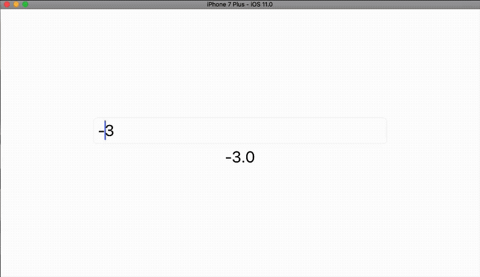

# Calculator

This small app is powered by [Parsel](https://github.com/BenchR267/Parsel). The whole logic is less than 60 lines of code in [Brain.swift](https://github.com/BenchR267/Calculator/blob/master/Calculator/Brain.swift#L43-L96).

# Author

* [@benchr](https://twitter.com/benchr), mail@benchr.de
